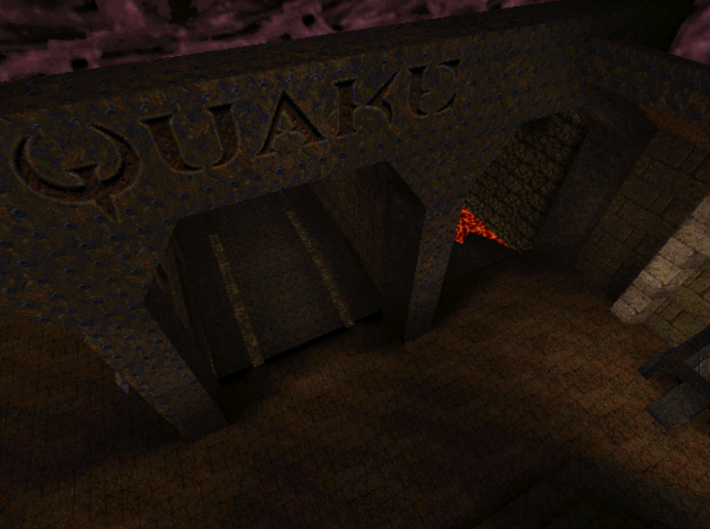
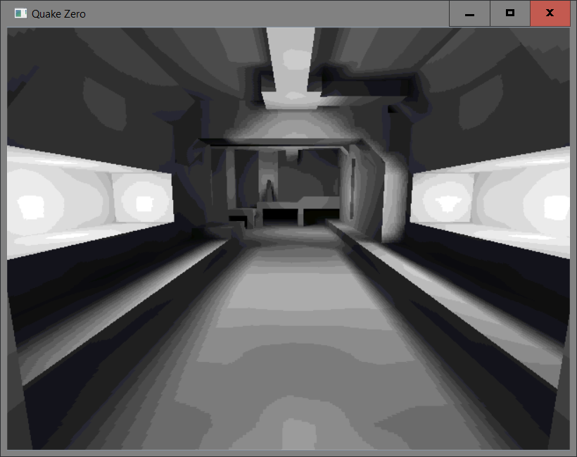

Quake Zero is a project out of curiosity about how 3D renderer was "hande made" in early
days. To fully understand what's actually going on under the hood, I
built the world renderer for Quake 1. Here is the result.

Thank you to [Casey Muratori](https://handmadehero.org/) and 
[Philip Buuck](http://philipbuuck.com/handmadequake) whose "handmade" projects 
inspired me to start my own one. And Michael Abrash's 
[Graphics Programming Black Book](https://github.com/jagregory/abrash-black-book) 
is the main reference resources. 

## To Build

- Create a folder with the name "assets" under the project root directory, and 
  put the PAK file of the original Quake 1 in it. 

- Set up Visual C++ environment by typing the following line into your command
  prompt. 

  "C:\Program Files (x86)\Microsoft Visual Studio 14.0\VC\vcvarsall.bat" amd64

  If you intalled the Visual Studio somewhere else, you need to navigate there 
  and run "vcvarsall.bat amd64". It has to be 64-bit environment otherwise the 
  unit tests will fail.

- In command prompt, go into folder "code", run "build.bat". You might get
  various warnings if you are not using Visual Studio Community 2015.

- Then run "vs.bat" to debug.

## Tests

If you run buil.bat under the "tests" folder, and run tests.exe, you can see,
after unit tests finish, a demo program illustrating how Quake's Cache Allocator
works.

## Demo Images

